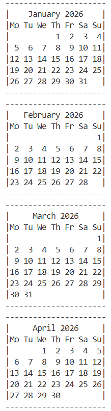

# Python_Calendar
# Python Calendar Generator

A beginner-friendly Python project that generates a full year calendar with custom ASCII-style borders using Python's built-in `calendar` module.

## Features

- Generates all 12 months of a year
- Custom ASCII box formatting
- Automatic width adjustment
- Terminal-friendly output

## Technologies Used

- Python
- calendar module

## Sample Output



## How to Run

```bash
python calendar_2026.py
```

## Future Improvements

- Colored terminal output
- User input for year selection
- Side-by-side month layout
- Export to text file
